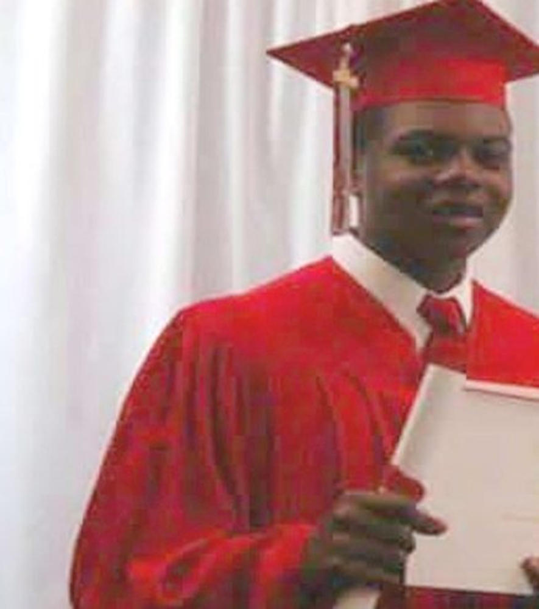

# Margaret LaVerne Mitchell, 54

Mitchell, who suffered from mental illness, was shot to death on May 21, 1999, in Los Angeles.

The homeless woman reportedly lunged at an officer with a screwdriver after two police officers stopped her while she pushed a shopping cart on La Brea Avenue. Some witnesses disputed statements that Mitchell lunged at one of the officers.

# LaTanya Haggerty, 26

Haggerty was a passenger in a car pulled over by Chicago police on June 4, 1999.

An officer shot Haggerty, thinking she was holding a gun, but Haggerty, who was talking on her cellphone, was unarmed.

# Amadou Diallo, 22

Diallo was an immigrant from the west African nation of Guinea when he was hit with 19 bullets fired by four New York City police officers. It was before dawn on Feb. 4, 1999.

The officers, none in uniform, thought Diallo fit the description of a man wanted for a series of rapes. They said they identified themselves as police as they approached Diallo. When Diallo reached into a pocket to pull out his wallet, they opened fire, saying they feared he was reaching for a gun. Diallo was unarmed.

A grand jury indicted the officers on charges of second-degree murder and reckless endangerment. A jury acquitted all of them. Diallo’s family sued the city and settled for $3 million.

# Kendra James, 21

James was shot in the head by a police officer in Portland, Ore., on May 5, 2003, after the car in which she was a passenger was pulled over.

A police officer said he fired in self-defense during a struggle with James, who moved into the driver’s seat after the driver was arrested. James was unarmed.

# Sean Bell, 23

Bell was scheduled to be married the morning after his fatal encounter with New York City police officers on Nov. 25, 2006. Bell was behind the wheel of a car outside a Queens strip club, where his bachelor party had been held. Police, including plainclothes officers who had been in the club, said they approached Bell amid concerns that someone in his party had a gun.

Officers opened fire, saying Bell had rammed his car into one of them. They said they had identified themselves as officers and showed their badges, an account disputed by some witnesses in a subsequent trial. Bell was shot in the neck and torso and died. Two friends in his car were shot but survived.

Three police officers were indicted on charges ranging from manslaughter to reckless endangerment. They were acquitted in 2008, but all were fired or forced to resign after the police department concluded they had acted improperly. A lawsuit filed by the victims’ families was settled for $7 million.

# Trayvon Martin, 17
On the night of February 26, 2012, in Sanford, Florida, United States, George Zimmerman fatally shot Trayvon Martin.

# Manuel Loggins Jr., 31

Loggins was a Marine sergeant and father of three when he was killed by an Orange County sheriff’s deputy on Feb. 7, 2012. The deputy approached Loggins after he crashed through a gate of San Clemente High School about 4:40 a.m. with two of his daughters inside his SUV.

According to the sheriff’s department, Loggins left the vehicle, then returned to it, ignored orders to show his hands and displayed a “mean” expression. The sheriff’s deputy, who said he feared for the girls’ safety, fired three shots through the window, killing Loggins as his daughters, 9 and 14, watched.

The deputy was not charged. Loggins’ family sued and settled for $4.4 million in May 2013.

# Ramarley Graham, 18

Graham was a teenager when police entered his Bronx apartment without a warrant and shot him inside a bathroom on Feb. 2, 2012. Surveillance videos from the police pursuit showed Graham walking into the building, then police officers going to the building’s door and kicking it in.

They then ran upstairs to Graham’s apartment. One shot Graham in the chest. The officer said he thought Graham was armed, based on conversations he said heard on his police radio. A bag of marijuana was found near Graham, but no weapon.

A judge threw out a manslaughter indictment on a technicality against the officer who shot Graham. A second grand jury failed to indict the officer, saying there was insufficient evidence to charge him. Graham’s family and local lawmakers called for the Justice Department to investigate. New York City in January 2015 agreed to pay $3.9 million to Graham’s family.

# Shereese Francis, 29
Francis, a mentally ill woman who had gone off her medication, died during a struggle with police who had been called to her home in Queens, N.Y., on March 15, 2012. Francis, who was unarmed, died of suffocation as officers tried to handcuff her.

# Rekia Boyd, 22
Boyd was fatally shot by an off-duty Chicago police detective on March 21, 2012, as she stood in an alley with a group of friends. A man in the group exchanged words with the detective, who fired five shots into the alley, hitting Boyd in the back of her head. No weapon was found in the alley.

# Jamar Clark, 24

The November 2013 shooting death of Clark sparked weeks of protests in Minneapolis. Authorities say Clark was killed during a struggle with police.

The officers, Mark Ringgenberg and Dustin Schwarze, were trying to arrest Clark when he was shot once in the head on Nov. 15. He died a day later.

A key issue in the investigations was whether Clark was handcuffed when he was shot. The federal and state probes came to the same conclusion: Clark was not. Hennepin County Atty. Mike Freeman cleared Ringgenberg and Schwarze of charges March 30, 2014, saying Clark was struggling for an officer’s gun when he was shot.

In June, Minnesota U.S. Atty. Andrew Luger declined to file civil rights charges against Ringgenberg and Schwarze, citing insufficient evidence.

# Yvette Smith, 47
Smith, a mother of two, was fatally shot on the front porch of her home on Feb. 16, 2014, by a deputy in Bastrop County, Texas. The sheriff’s office first said Smith was armed. Later, it retracted that statement.

# Tamir Rice, 12

Rice was shot and killed in a park in Cleveland on Nov. 22, 2014.

Officers Timothy Loehmann and Frank Garmback responded to a call about a black male sitting on a swing and pointing a gun at people in a city park. The caller expressed doubts about the gun’s authenticity and said the male was probably a juvenile, but that information wasn’t relayed to the responding officers. Within two seconds of arriving at the scene, Loehmann fired two shots, one hitting Rice in the torso.

Rice’s weapon later was found to be a black toy gun. In December 2015, a grand jury declined to indict Loehmann or Garmback.

# Laquan McDonald, 17

Chicago Police Officer Jason Van Dyke is charged with first-degree murder in the 2014 shooting death of black teenager McDonald. Van Dyke was charged in November on the same day that the city, on the orders of a judge, released the explosive dash-cam video showing McDonald being shot 16 times.

On the night of the shooting, Van Dyke and his partner trailed McDonald for nearly half a mile, from a trucking yard where he was said to have been breaking into vehicles. The officers radioed for a Taser in order to apprehend McDonald, who they said was carrying a knife in the middle of the road. According to the video, the officers arrived 10 minutes after the first call and, within 21 seconds, Van Dyke had emptied his 16-round handgun.

Van Dyke has pleaded not guilty and is free on bond. The video has prompted local and federal investigations into both the shooting and the police department.

# Akai Gurley, 28
Peter Liang, a rookie New York City police officer, was convicted Feb. 11 of manslaughter in the death of Gurley.

Liang was patrolling a public housing high-rise with his gun drawn in 2014 when he fired and a bullet ricocheted off a wall, hitting Gurley. Liang said he had been holding his weapon safely when a sound jarred him and he accidentally fired.

In April, a judge reduced the conviction to negligent homicide and sentenced Liang to five years’ probation and 800 hours of community service.

# Eric Garner, 43
Garner died July 17, 2014, after a police officer in Staten Island, N.Y., placed him in an illegal chokehold during an encounter on the sidewalk, where police said Garner was selling illegal cigarettes. A bystander shot video showing Garner’s final moments, and it quickly fueled major protests and demands that the officers involved face criminal charges.

The city’s medical examiner ruled Garner’s death a homicide because of the compression of his neck and chest. Two officers faced an internal investigation in connection with Garner’s death: The one who applied the chokehold was put on modified duty, meaning he was stripped of his gun and badge, while a police sergeant was stripped of her gun and badge and charged internally with failure to supervise.

Neither has been charged with a crime, and police say Garner’s poor health and his refusal to cooperate with officers contributed to his death. Police Commissioner William J. Bratton ordered a review of police training techniques in the wake of Garner’s death.

# Philando Castile
On July 6, 2016, Philando Castile, a 32-year-old African American man, was stopped while driving and fatally shot by Jeronimo Yanez, a 29-year-old Hispanic-American police officer from St. Anthony, Minnesota.

# Alton Sterling
On July 5, 2016, Alton Sterling, a 37-year-old black man, was shot dead at close range by two white Baton Rouge Police Department officers in Baton Rouge, Louisiana.

# Ezell Ford, 25

Ezell Ford, a 25-year-old black man, was shot after two Los Angeles Police Department officers stopped him on a sidewalk in South L.A. The shooting came only days after the fatal shooting of Michael Brown in Ferguson, Mo., and set off a series of protests throughout L.A. County. 

On Aug. 11, 2014, two gang unit officers conducted an investigative stop after seeing Ford on 65th Street. Police say that when the officials got out of their vehicle and walked toward Ford, he tried to attack the lead officer. After a struggle, the lead officer’s partner shot Ford, who later died at a hospital.

Community members questioned the police account, saying Ford was mentally ill and was complying with officers before he was shot. In June 2015, the L.A. Police Commission faulted Officer Sharlton Wampler and his partner, Antonio Villegas, for how they approached Ford in the moments that led to the shooting.

# Michael Brown Jr., 18

Brown, a black teenager, was gunned down by a white police officer in Ferguson, Mo., after stealing cigarillos from a convenience store. The shooting resulted in weeks of riots and protests in Ferguson and around the country while drawing attention to the relationship between African Americans and law enforcement in the U.S.

On Aug. 9, 2014, Officer Darren Wilson responded to a reported robbery and encountered Brown and his friend Dorian Johnson walking down the middle of the road. Wilson blocked the two with his police car, after which a struggle ensued through the window. Wilson fired his gun and followed Brown after he fled. When Brown stopped to face the officer, Wilson fired several shots at his front, killing him.

St. Louis County Prosecutor Robert McCulloch announced Nov. 24, 2014, that a grand jury had decided not to indict Wilson, and the Department of Justice cleared Wilson of civil rights violations in March 2015. Officials found evidence that Wilson shot Brown in self-defense.

# Christian Taylor, 19

An unarmed black Angelo State University football player was shot and killed during a suspected burglary at an Arlington, Texas, car dealership last August. Taylor was shot after Arlington Police officer Brad Miller was called to the dealership.

Police Chief Will Johnson said Miller pursued Taylor without telling his supervising officer. Miller was fired from the department, but a grand jury decided to take no action against the officer. An autopsy determined Taylor had likely used a synthetic psychedelic drug and marijuana before the deadly confrontation.

# Walter Scott, 50
Michael Slager faces up to 30 years in prison if convicted of murder in the shooting death of Scott, who was running away on foot from a traffic stop in North Charleston, S.C., in April 2015. Scott was unarmed.

The shooting was captured on cellphone video by a passerby. Slager fired eight times at Scott before he was killed, reigniting the debate over how blacks are treated by law enforcement officers.

Slager, 34, was fired by the North Charleston Police Department and stands trial in October. Previously held in solitary confinement, he has been free since January, when he was released on $500,000 bail and put under house arrest. Last fall, North Charleston approved a $6.5-million civil settlement with Scott’s family.

# Natasha McKenna, 37
McKenna died after being shocked four times with a stun gun while her hands were cuffed and her legs shackled. McKenna, who suffered from mental illness, was in custody in the Fairfax County, Va., jail on Feb. 3, 2015, when a deputy used the stun gun on her. She died Feb. 8.

# Freddie Gray, 25

Six Baltimore police officers faced charges ranging from misconduct to second-degree murder in the April 2015 death of Freddie Gray.

Gray died when his neck was broken in the back of a police transport van. He had been restrained with handcuffs and leg irons, but not a seat belt. The death set off several days of rioting in Baltimore.

The involuntary manslaughter trial of the first of those charged, Officer William Porter, ended in December in a hung jury. A judge acquitted two other officers in bench trials. The city of Baltimore paid Gray’s family $6.4 million as a settlement for civil claims.

# Brendon Glenn, 29

Los Angeles Police Chief Charlie Beck in January recommended criminal charges be brought against Officer Clifford Proctor, who fatally shot an unarmed black man in the back.

Proctor told investigators he saw Glenn’s hand on his partner’s holster. But an LAPD report that drew upon security footage from a nearby bar in Venice found Glenn’s hand was nowhere near the holster.

The shooting in May 2015 sparked angry protests. It was the first time Beck recommended charges against an officer in a shooting. Investigators concluded that Glenn was on his stomach trying to push himself up when Proctor shot him.

# Samuel DuBose, 43
Ray Tensing, then a University of Cincinnati police officer, was indicted in July 2015 on a murder charge in the fatal shooting of DuBose, who was unarmed when he was pulled over for a traffic stop.

Tensing pulled over DuBose near campus for a missing license plate. His attorney said Tensing feared being dragged under the car as DuBose tried to drive away. The shooting was captured on video by Tensing’s body camera and depicts DuBose repeatedly being asked for his driver’s license. After DuBose refuses to produce it and get out of the car, a gunshot is heard.

Tensing, who was fired from the department, was released from jail after posting 10% of $1-million bond. The county prosecutor called the shooting a “senseless act.” Tensing is scheduled to face a jury starting Oct. 24.

# Akiel Denkins, 24
A North Carolina prosecutor concluded that a white officer acted in self-defense when he shot a black man in Raleigh. Police have said Denkins pulled out a gun and reached for Officer D.C. Twiddy’s weapon before the officer shot and killed him earlier this year. Twiddy was trying to arrest Denkins in late February 2016 after he failed to appear in court on felony charges related to selling cocaine.

# Gregory Gunn, 58
Montgomery, Ala., police officer Aaron Smith has been charged with murder in the February shooting death of Gunn. Smith shot Gunn, who was unarmed, in the early hours of Feb. 25, steps away from the man’s home.

According to a Montgomery police statement, Smith “approached a suspicious person and a struggle ensued.” Tyrone C. Means, the Gunn family’s attorney, said he had not been told what the suspicious activity was. Witnesses reported that Gunn was knocking on the window of a neighbor’s house, pleading for help.

Rep. Alvin Holmes, whose district is in Montgomery, drafted a letter with Means to send to U.S. Atty. Gen. Loretta Lynch. They requested that the Justice Department assign an investigator to conduct a full inquiry.

# Botham Jean, 26
On September 6, 2018, off-duty Dallas Police Department patrol officer Amber Guyger entered the Dallas, Texas, apartment of 26-year-old accountant Botham Jean and fatally shot him. Guyger said that she had entered the apartment believing it was her own and that she shot Jean believing he was a burglar. The fact that Guyger, a white police officer, shot and killed Jean, an unarmed black man, and was initially only charged with manslaughter, resulted in protests and accusations of racial bias. On October 1, 2019, Guyger was found guilty of murder. The next day, she received a sentence of ten years in prison.

# Breonna Taylor
On March 13, 2020, Breonna Taylor, a 26-year-old African American woman, was fatally shot by Louisville Metro Police Department (pictures/LMPD) officers. Sergeant Jonathan Mattingly, Detective Brett Hankison, and Detective Myles Cosgrove entered her apartment in plainclothes in Louisville, Kentucky, while serving a "no-knock warrant".

# Ahmaud Arbery, 25
On February 23, 2020, Ahmaud Marquez Arbery, an unarmed 25-year-old African-American man, was fatally shot near Brunswick in Glynn County, Georgia, while jogging on Holmes Road just before entering its intersection with Satilla Drive in the Satilla Shores neighborhood. Arbery had been pursued and confronted by two white residents, Travis McMichael and his father Gregory, who were armed and driving a pickup truck.

# George Floyd
On May 25th Derek Chauvin murdered George Floyd while three other police officers watched.

# David McAtee

David McAtee owned YaYa's BBQ in Louisville, KY. He was in the BBQ business for 30 years and fed cops who came by for free. He was shot and killed by the police on June 1st 2020